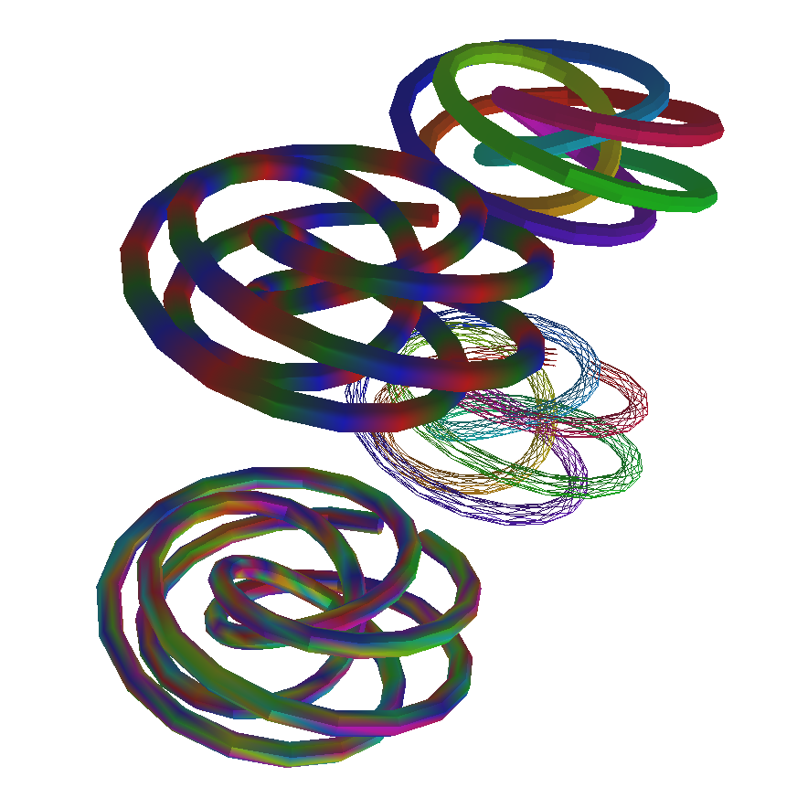
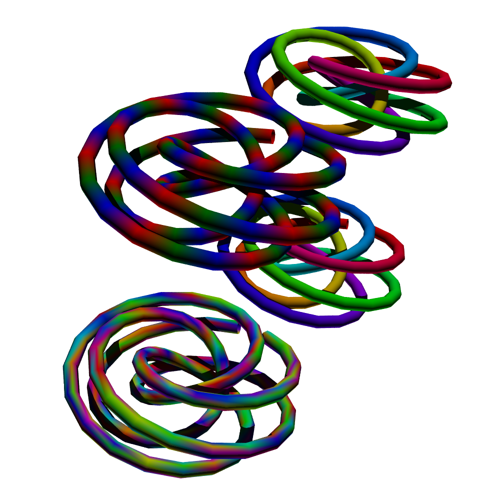

Vispy to POVRay
===============

This module converts (hackily) Vispy scenes to immediately-compilable
POVRay files. It tries to extract the mesh from any Mesh node in a
ViewBox. Right now it doesn't look for anything else, so only
these visuals are exported (though in practice, quite a few visuals
subclass MeshVisual).

This is highly incomplete and *will* probably break in the future,
such as when collections are applied to visuals and meshes are merged
or if parts of the unstable internal api is changed.

Example usage::

    from vispy.scene import SceneCanvas
    s = SceneCanvas(...)
    # ... add some meshes

    from vispytopovray import export_to_povray
    export_to_povray(s, 'povray_output.pov')

Then compile the scene, e.g.::

    povray +W1000 +H1000 +A povray_output.pov

The code currently assumes the output will be square, so giving
POVRay a different aspect ratio will give distorted results.

The examples folder includes some results based on Vispy examples,
such as the following in for the tube example.

          
One tube has only its mesh outline drawn by Vispy, but the full
surface drawn by POVRay; this is because this property isn't (yet?)
exported to POVRay. Another tube has its faces drawn flat by Vispy
but smoothed by POVRay for the same reason.
