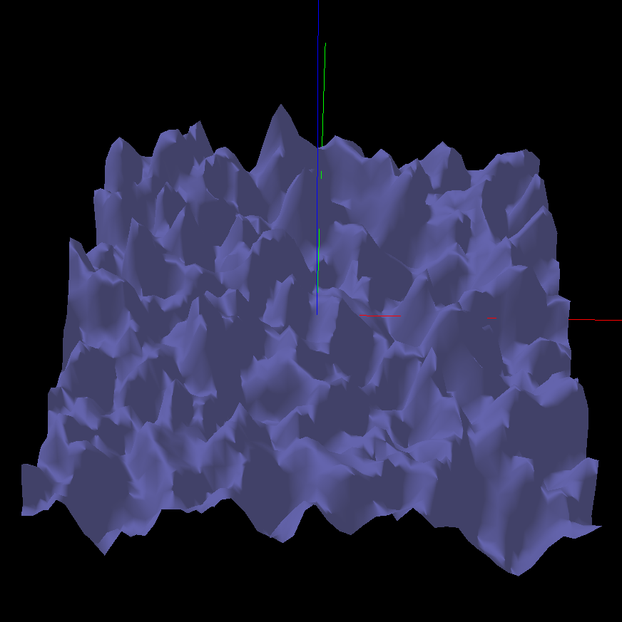
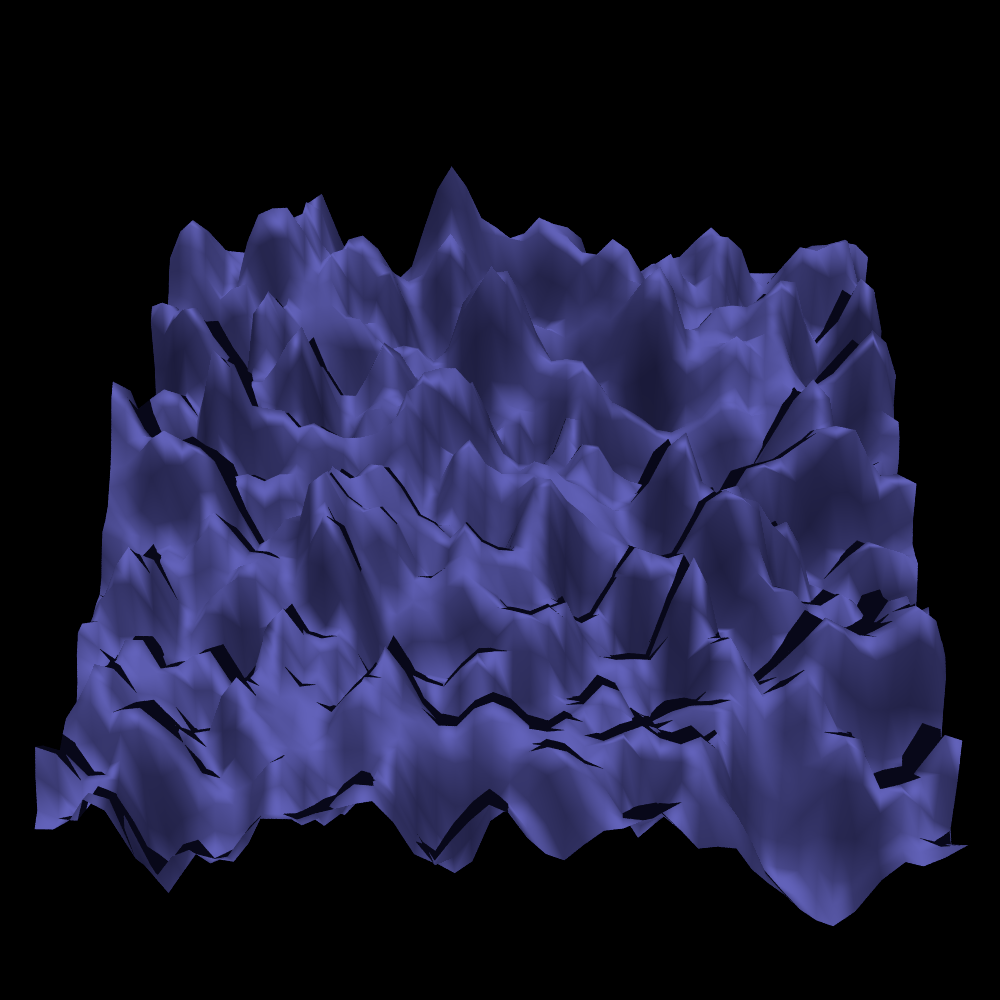

Vispy to POV-Ray
===============

This module converts (hackily) Vispy scenes to immediately-compilable
POV-Ray files. It tries to extract the mesh from any Mesh node in a
ViewBox. Right now it doesn't look for anything else, so only Mesh
nodes of a vispy scene via a ViewBox are exported. It also only works
with a non-zero camera fov, orthographic projection is not exported.

This is highly incomplete and experimental and will probably break in
the future, such as when collections are applied to visuals or if
parts of the unstable internal api are changed.

Example usage::

    from vispy.scene import SceneCanvas
    s = SceneCanvas(...)
    # ... add some meshes

    from vispytopovray import export_to_povray
    export_to_povray(s, 'povray_output.pov')

Then compile the scene, e.g.::

    povray +W1000 +H1000 +A povray_output.pov

The code currently assumes the output will be square, so giving
POV-Ray a different aspect ratio will give distorted results.

The examples folder includes some results based on Vispy examples,
such as the following surface plot:

          
Or the Tube visual example:

.. image:: examples/tubes_vispy.png
    :width: 150px
    :alt: Vispy tube example screenshot

.. image:: examples/tubes_povray.png
    :width: 150px
    :alt: POV-Ray tube example
          
One tube has only its mesh outline drawn by Vispy, but the full
surface drawn by POV-Ray; this is because this property isn't (yet?)
exported to POV-Ray. Another tube has its faces drawn flat by Vispy
but smoothed by POV-Ray for the same reason.
